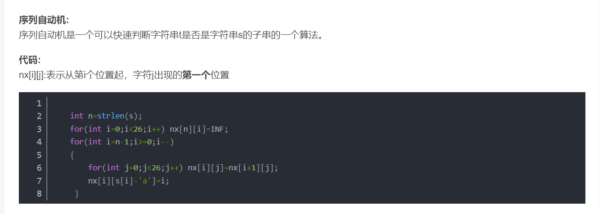
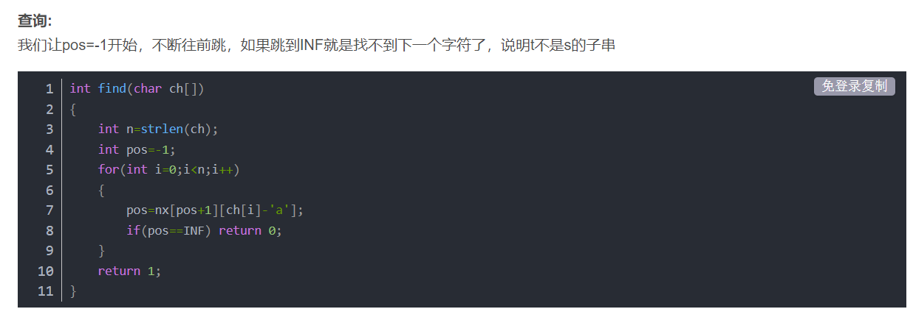

#### [520. 检测大写字母](https://leetcode-cn.com/problems/detect-capital/)

状态机解法

```C++
class Solution {
public:
    bool detectCapitalUse(string word) {
        char cur_s = 'a';
        int lenth = word.size();
        int i=0;
        bool is_upper;
        while(i < lenth)
        {
            is_upper = word[i]>='A' && word[i]<='Z';
            switch(cur_s)
            {
                case 'a':
                {
                    cur_s = is_upper ? 'b' : 'c';
                    break;
                }
                case 'b':
                {
                    cur_s = is_upper ? 'd' : 'c';
                    break;
                }
                case 'c':
                {
                    if(is_upper)
                        return false;
                    break;
                }
                case 'd':
                {
                    if(!is_upper)
                        return false;
                    break;
                }
            }
            i++;
        }
        if(cur_s == 'a')
            return false;
        else
            return true;
    }
};
```

#### [125. 验证回文串](https://leetcode-cn.com/problems/valid-palindrome/)

注意考虑所给条件。设置头尾两个指针，向中间靠拢。

* 若遇到非字母且非数字，跳过；
* 若头尾相等，则继续循环；
* 若不相等，判断头尾是否为字母且ASCII绝对值差为32，若是则继续循环，否则该字符串不是回文串。

```C++
class Solution {
public:
    bool isPalindrome(string s) {
        bool result = true;
        int lenth = s.size();
        int head=0, tail=lenth-1;
        while(head < tail)
        {
            while(!isalnum(s[head]) && head<lenth)
                head++;
            while(!isalnum(s[tail]) && tail>head)
                tail--;
            if(tail < head)
                break;
            if(s[head]==s[tail] || 
                (isalpha(s[head]) && isalpha(s[tail]) && abs(s[head]-s[tail])==32))
            {
                head++;
                tail--;
            }
            else
            {
                result = false;
                break;
            }
        }
        return result;
    }
};
```

#### [14. 最长公共前缀](https://leetcode-cn.com/problems/longest-common-prefix/)

纵向扫描，以第一个为基准。

```C++
class Solution {
public:
    string longestCommonPrefix(vector<string>& strs) {
        string result = "";
        bool loopflag = true;
        int strnum=strs.size(), i=0;
        vector<int> pos(strnum, 0);
        for(string str:strs)
        {
            if(str == "")
                return result;
        }
        char temp = strs[0][0];
        while(loopflag)
        {
            for(i=0; i<strnum; i++)
            {
                if(temp == strs[i][pos[i]])
                {
                    pos[i]++;
                    if(pos[i] == strs[i].size())
                        loopflag = false;
                }
                else
                    return result;
            }
            result += temp;
            if(pos[0] == strs[0].size())
                loopflag = false;
            else
                temp = strs[0][pos[0]];
        }
        return result;
    }
};
```

#### [434. 字符串中的单词数](https://leetcode-cn.com/problems/number-of-segments-in-a-string/)

状态机解法

```C++
class Solution {
public:
    int countSegments(string s) {
        int count=0, lenth=s.size();
        char cur_s = 'A';
        for(int i=0; i<lenth; i++)
        {
            switch(cur_s)
            {
                case 'A':
                {
                    if(s[i] != ' ')
                    {
                        cur_s = 'B';
                        count++;
                    }
                    break;
                }
                case 'B':
                {
                    if(s[i] == ' ')
                        cur_s = 'A';
                    break;
                }
            }
        }
        return count;
    }
};
```

#### [58. 最后一个单词的长度](https://leetcode-cn.com/problems/length-of-last-word/)

从后往前遍历即可

```C++
class Solution {
public:
    int lengthOfLastWord(string s) {
        int lenth=s.size(), result=0;
        int i = lenth - 1;
        while(!isalpha(s[i]))
            i--;
        result = i;
        while(i>=0 && isalpha(s[i]))
            i--;
        return result - i;
    }
};
```

#### [344. 反转字符串](https://leetcode-cn.com/problems/reverse-string/)

```c++
class Solution {
public:
    void reverseString(vector<char>& s) {
        int i=0, j=s.size()-1;
        while(i < j)
        {
            swap(s[i], s[j]);
            i++;
            j--;
        }
    }
};
```

#### [541. 反转字符串 II](https://leetcode-cn.com/problems/reverse-string-ii/)

与上题类似，只不过需要处理翻转的范围

```C++
class Solution {
public:
    string reverseStr(string s, int k) {
        int lenth=s.size(), i=0, left, right, full, remain;
        string result = s;
        full = lenth / (2 * k);
        remain = lenth % (2 * k);
        for(i=0; i<full; i++)
        {
            left = i * k * 2;
            right = left + k - 1;
            while(left < right)
            {
                swap(result[left], result[right]);
                left++;
                right--;
            }
        }
        left = i * k * 2;
        right = (remain < k) ? lenth - 1 : left + k - 1;
        while(left < right)
        {
            swap(result[left], result[right]);
            left++;
            right--;
        }
        return result;
    }
};
```

#### [557. 反转字符串中的单词 III](https://leetcode-cn.com/problems/reverse-words-in-a-string-iii/)

扫描原字符串，截取单词，然后从后往前将字符加入到`result`中，除了末尾，再加一个空格。需要注意边界条件

```C++
class Solution {
public:
    string reverseWords(string s) {
        int i=0, left, right, lenth=s.size();
        string result = "";
        bool mode = false;
        while(i < lenth)
        {
            if(s[i]==' ' || i==lenth-1)
            {
                if(mode)
                {
                    mode = false;
                    right = (s[i]!=' ') ? i : i - 1;
                    while(left <= right)
                    {
                        result += s[right];
                        right--;
                    }
                    if(i != lenth - 1) result += ' ';
                }
                else if(i == lenth - 1)
                    result += s[i];
            }
            else
            {
                if(!mode)
                {
                    mode = true;
                    left = i;
                }
            }
            i++;
        }
        return result;
    }
};
```

#### [151. 翻转字符串里的单词](https://leetcode-cn.com/problems/reverse-words-in-a-string/)

先将整个字符串翻转，然后使用上题的方法即可

```C++
class Solution {
public:
    string reverseWords(string s) {
        reverse(s.begin(), s.end());
        int n = s.size();
        int idx = 0;
        for (int start = 0; start < n; ++start) 
        {
            if (s[start] != ' ') 
            {
                if (idx != 0) s[idx++] = ' ';
                int end = start;
                while (end < n && s[end] != ' ') s[idx++] = s[end++];
                reverse(s.begin() + idx - (end - start), s.begin() + idx);
                start = end;
            }
        }
        s.erase(s.begin() + idx, s.end());
        return s;
    }
};
```

#### [387. 字符串中的第一个唯一字符](https://leetcode-cn.com/problems/first-unique-character-in-a-string/)

利用散列存储，设置标记数组，存储每个字母的出现情况，当它为-1时，对应字母没有出现；当它为-2时，对应字母重复出现；当它非负时，为第一次出现的位置。

```C++
class Solution {
public:
    int firstUniqChar(string s) {
        vector<int> mark(26, -1);
        int lenth=s.size(), i, index;
        for(i=0; i<lenth; i++)
        {
            index = s[i] - 97;
            if(mark[index] > -1)
                mark[index] = -2;
            else if(mark[index] == -1)
                mark[index] = i;
            else
                continue;
        }
        int result = lenth;
        for(i=0; i<26; i++)
        {
            if(result>mark[i] && mark[i]>-1)
                result=mark[i];
        }
        return (result==lenth) ? -1 : result;
    }
};
```

#### [389. 找不同](https://leetcode-cn.com/problems/find-the-difference/)

设置计数数组，对两个字符串出现次数计数，其中为奇数的对应字母是被添加的字母

```C++
    char findTheDifference(string s, string t) {
        int slenth=s.size(), i=0;
        int count[26] = {0};
        for(i=0; i<slenth; i++)
        {
            count[s[i] - 97]++;
            count[t[i] - 97]++;
        }
        count[t[i] - 97]++;
        i=0;
        while(count[i] % 2 == 0)i++;
        return (char)(i + 97);
    }
};
```

#### [383. 赎金信](https://leetcode-cn.com/problems/ransom-note/)

设置计数数组，记录杂志每个字母的数量，然后遍历赎金信，每使用一个字母，对应计数减一，若某个字母不够用，则返回`false`

```C++
class Solution {
public:
    bool canConstruct(string ransomNote, string magazine) {
        int count[26] = {0};
        int m_lenth=magazine.size(), r_lenth=ransomNote.size();
        for(int i=0; i<m_lenth; i++)
            count[magazine[i] - 97]++;
        for(int i=0; i<r_lenth; i++)
        {
            if(count[ransomNote[i] - 97] > 0)
                count[ransomNote[i] - 97]--;
            else
                return false;
        }
        return true;
    }
};
```

#### [242. 有效的字母异位词](https://leetcode-cn.com/problems/valid-anagram/)

设置计数数组，若两个字符串长度不一，则返回`false`，遍历两个数组，一个对应字母计数自增，另一个对应字母计数自减。遍历计数数组，若存在不为零的字母则返回`false`

```C++
class Solution {
public:
    bool isAnagram(string s, string t) {
        int slen=s.size(), tlen=t.size();
        int mark[26]={0};
        if(slen != tlen)
            return false;
        for(int i=0; i<slen; i++)
        {
            mark[s[i] - 'a']++;
            mark[t[i] - 'a']--;
        }
        for(int i=0; i<26; i++)
        {
            if(mark[i] != 0)
                return false;
        }
        return true;
    }
};
```

#### [49. 字母异位词分组(*)](https://leetcode-cn.com/problems/group-anagrams/)

哈希

```C++
class Solution {
public:
    vector<vector<string>> groupAnagrams(vector<string>& strs) {
        // 自定义对 array<int, 26> 类型的哈希函数
        auto arrayHash = [fn = hash<int>{}] (const array<int, 26>& arr) -> size_t {
            return accumulate(arr.begin(), arr.end(), 0u, [&](size_t acc, int num) {
                return (acc << 1) ^ fn(num);
            });
        };

        unordered_map<array<int, 26>, vector<string>, decltype(arrayHash)> mp(0, arrayHash);
        for (string& str: strs) {
            array<int, 26> counts{};
            int length = str.length();
            for (int i = 0; i < length; ++i) {
                counts[str[i] - 'a'] ++;
            }
            mp[counts].emplace_back(str);
        }
        vector<vector<string>> ans;
        for (auto it = mp.begin(); it != mp.end(); ++it) {
            ans.emplace_back(it->second);
        }
        return ans;
    }
};
```

#### [451. 根据字符出现频率排序](https://leetcode-cn.com/problems/sort-characters-by-frequency/)

设置字典计数

```python
class Solution:
    def frequencySort(self, s: str) -> str:
        dict = {}
        for i in s:
            if(i in dict):
                dict[i] = dict[i] + 1
            else:
                dict[i] = 1
        dict_order = sorted(dict.items(), key=lambda x:x[1], reverse=True)
        result = ""
        for d in dict_order:
            result += d[0] * d[1]
        return result
```

#### [423. 从英文中重建数字(*)](https://leetcode-cn.com/problems/reconstruct-original-digits-from-english/)

必须将拥有唯一字母的数字排在前面筛选，否则会出现错误

```C++
class Solution {
public:
    string originalDigits(string s) {
        unordered_map<char, int> c;
        for (char ch: s) {
            ++c[ch];
        }
        vector<int> cnt(10);
        cnt[0] = c['z'];
        cnt[2] = c['w'];
        cnt[4] = c['u'];
        cnt[6] = c['x'];
        cnt[8] = c['g'];
        
        cnt[3] = c['h'] - cnt[8];
        cnt[5] = c['f'] - cnt[4];
        cnt[7] = c['s'] - cnt[6];

        cnt[1] = c['o'] - cnt[0] - cnt[2] - cnt[4];

        cnt[9] = c['i'] - cnt[5] - cnt[6] - cnt[8];

        string ans;
        for (int i = 0; i < 10; ++i) {
            for (int j = 0; j < cnt[i]; ++j) {
                ans += char(i + '0');
            }
        }
        return ans;
    }
};
```

#### [657. 机器人能否返回原点](https://leetcode-cn.com/problems/robot-return-to-origin/)

判断上与下、左与右的步数是否相等即可

```C++
class Solution {
public:
    bool judgeCircle(string moves) {
        int UD=0, LR=0;
        for(auto move:moves)
        {
            switch(move)
            {
                case 'U':
                    UD++;
                    break;
                case 'D':
                    UD--;
                    break;
                case 'L':
                    LR++;
                    break;
                case 'R':
                    LR--;
                    break;
                default:
                    break;
            }
        }
        if(UD==0 && LR==0)
            return true;
        else
            return false;
    }
};
```

#### [551. 学生出勤记录 I](https://leetcode-cn.com/problems/student-attendance-record-i/)

遍历字符串即可，注意判断条件

```C++
class Solution {
public:
    bool checkRecord(string s) {
        bool A_count = false;
        char L_count = 0;
        for(auto x:s)
        {
            if(x =='A')
            {
                if(A_count)
                    return false;
                else
                    A_count = true;
                L_count = 0;
            }
            else if(x == 'L')
            {
                if(L_count == 2)
                    return false;
                else
                    L_count++;
            }
            else
                L_count = 0;
        }
        return true;
    }
};
```

#### [696. 计数二进制子串(*)](https://leetcode-cn.com/problems/count-binary-substrings/)

记录每一段连续0和连续1的个数，比较相邻`count`，将较小的数加入到结果中

```C++
class Solution {
public:
    int countBinarySubstrings(string s) {
        int ptr = 0, n = s.size(), last = 0, ans = 0;
        while (ptr < n) {
            char c = s[ptr];
            int count = 0;
            while (ptr < n && s[ptr] == c) {
                ++ptr;
                ++count;
            }
            ans += min(count, last);
            last = count;
        }
        return ans;
    }
};
```

#### [467. 环绕字符串中唯一的子字符串(*)](https://leetcode-cn.com/problems/unique-substrings-in-wraparound-string/)

记录以每个字符串结尾的子串个数

```C++
class Solution {
public:
    int findSubstringInWraproundString(string p) {
        int i=0;
        int n=p.size();
        int ans=0;
        vector<int>chars(26,0);
        int len=1;
        chars[p[0]-'a']=1;
        for(int i=1;i<n;i++){
            if(p[i-1]+1==p[i]||p[i-1]=='z'&&p[i]=='a')len++;
            else len=1;
            chars[p[i]-'a']=max(chars[p[i]-'a'],len);
        }
        return accumulate(chars.begin(),chars.end(),0);
    }
};
```

#### [535. TinyURL 的加密与解密(*)](https://leetcode-cn.com/problems/encode-and-decode-tinyurl/)

```java
public class Codec {
    String alphabet = "0123456789abcdefghijklmnopqrstuvwxyzABCDEFGHIJKLMNOPQRSTUVWXYZ";
    HashMap<String, String> map = new HashMap<>();
    Random rand = new Random();
    String key = getRand();

    public String getRand() {
        StringBuilder sb = new StringBuilder();
        for (int i = 0; i < 6; i++) {
            sb.append(alphabet.charAt(rand.nextInt(62)));
        }
        return sb.toString();
    }

    public String encode(String longUrl) {
        while (map.containsKey(key)) {
            key = getRand();
        }
        map.put(key, longUrl);
        return "http://tinyurl.com/" + key;
    }

    public String decode(String shortUrl) {
        return map.get(shortUrl.replace("http://tinyurl.com/", ""));
    }
}
```

#### [299. 猜数字游戏](https://leetcode-cn.com/problems/bulls-and-cows/)

满足`secret[i] == guess[i]`的个数即为公牛个数；其余的进行计数，然后逐个字母进行比较，将出现次数较小的加入到奶牛中（若一个出现另一个没有出现，则加0）

```python
class Solution:
    def getHint(self, secret: str, guess: str) -> str:
        result = ""
        lsecret = list(secret)
        lguess = list(guess)
        secret_dict = {}
        guess_dict = {}
        lenth = len(secret)
        bull = 0
        cow = 0
        for i in range(lenth):
            if(lsecret[i] == lguess[i]):
                bull += 1
                lsecret[i] = 'x'
                lguess[i] = 'x'
        result += str(bull) + 'A'
        for i in range(lenth):
            if(lsecret[i] == 'x'):
                continue
            else:
                if lsecret[i] in secret_dict:
                    secret_dict[lsecret[i]] += 1
                else:
                    secret_dict[lsecret[i]] = 1
                if lguess[i] in guess_dict:
                    guess_dict[lguess[i]] += 1
                else:
                    guess_dict[lguess[i]] = 1
        for k in guess_dict.keys():
            if k in secret_dict:
                cow += min(guess_dict[k], secret_dict[k])
        result += str(cow) + 'B'
        return result
```

#### [412. Fizz Buzz](https://leetcode-cn.com/problems/fizz-buzz/)

```python
class Solution:
    def fizzBuzz(self, n: int) -> List[str]:
        temp = ""
        result = []
        for i in range(1, n+1):
            temp = ""
            if(i % 3 == 0):
                temp += "Fizz"
            if(i % 5 == 0):
                temp += "Buzz"
            if(len(temp) == 0):
                temp = str(i)
            result.append(temp)
        return result
```

#### [506. 相对名次](https://leetcode-cn.com/problems/relative-ranks/)

先设置一个字典，保存每个数字原本的位置；然后将数组排序，前三名使用特殊字符串（金银铜牌），之后的名次查询字典即可

```python
class Solution:
    def findRelativeRanks(self, score: List[int]) -> List[str]:
        lenth = len(score)
        result = [""] * lenth
        pos_dict = {}
        for i in range(lenth):
            pos_dict[score[i]] = i
        score.sort(reverse=True)

        result[pos_dict[score[0]]] = "Gold Medal"
        if(lenth < 2):
            return result

        result[pos_dict[score[1]]] = "Silver Medal"
        if(lenth < 3):
            return result

        result[pos_dict[score[2]]] = "Bronze Medal"
        
        for i in range(3, lenth):
            result[pos_dict[score[i]]] = str(i+1)
        return result
```

#### [539. 最小时间差](https://leetcode-cn.com/problems/minimum-time-difference/)

先将每个字符串表示的时间按照分钟数计算，然后将新数组排序，计算相邻时间差和头尾时间差，取最小值

```python
class Solution:
    def findMinDifference(self, timePoints: List[str]) -> int:
        if(len(timePoints) > 1440):
            return 0
        minutes = []
        for s in timePoints:
            [hour, minute] = s.split(":")
            minutes.append(int(hour) * 60 + int(minute))
        minutes.sort()
        lenth = len(minutes)
        temp = 3601
        for i in range(lenth - 1):
            if temp > minutes[i+1] - minutes[i]:
                temp = minutes[i+1] - minutes[i]
        if temp > minutes[0] + 1440 - minutes[lenth - 1]:
            temp = minutes[0] + 1440 - minutes[lenth - 1]
        return temp
```

#### [553. 最优除法(*)](https://leetcode-cn.com/problems/optimal-division/)

```java
public class Solution {
    public String optimalDivision(int[] nums) {
        if (nums.length == 1)
            return nums[0] + "";
        if (nums.length == 2)
            return nums[0] + "/" + nums[1];
        StringBuilder res = new StringBuilder(nums[0] + "/(" + nums[1]);
        for (int i = 2; i < nums.length; i++) {
            res.append("/" + nums[i]);
        }
        res.append(")");
        return res.toString();
    }
}
```

#### [537. 复数乘法](https://leetcode-cn.com/problems/complex-number-multiplication/)

将复数乘法展开即可

```python
class Solution:
    def complexNumberMultiply(self, num1: str, num2: str) -> str:
        temp = num1.split("+")
        a1 = int(temp[0])
        b1 = int(temp[1][:-1])
        
        temp = num2.split("+")
        a2 = int(temp[0])
        b2 = int(temp[1][:-1])

        a3 = a1 * a2 - b1 * b2
        b3 = a1 * b2 + a2 * b1
        result = str(a3) + "+" + str(b3) + "i"
        return result
```

#### [592. 分数加减运算](https://leetcode-cn.com/problems/fraction-addition-and-subtraction/)

基本属于体力劳动

```python
class Solution:
    def gcd_2(self, x,y):
        result = 1
        if x > y:
            smaller = y
        else:
            smaller = x
        for i in range(1,smaller + 1):
            if((x % i == 0) and (y % i == 0)):
                result = i
        return result

    def gbs_2(self, a,b):
        gcd = self.gcd_2(a,b)
        gbs = a//gcd * b//gcd * gcd
        return gbs

    def gbs_list(self, nums):
        if len(nums) == 1:
            return nums[0]
        a,b = nums[0],nums[1]
        a = self.gbs_2(a,b)
        for i in range(2,len(nums)):
            a = self.gbs_2(a,nums[i])
        return a

    def fractionAddition(self, expression: str) -> str:
        expression = expression.replace("-", "+-")
        temp = expression.split("+")
        up = []
        down = []
        if(temp[0] == ""):
            temp.pop(0)
        for t in temp:
            [a, b] = t.split("/")
            up.append(int(a))
            down.append(int(b))
        GBS = self.gbs_list(down)
        lenth = len(up)
        sumup = 0
        for i in range(lenth):
            sumup += up[i] * (GBS // down[i])
        if(sumup == 0):
            return "0/1"
        GCD = self.gcd_2(abs(sumup), GBS)
        result_up = sumup // GCD
        result_down = GBS // GCD
        result = ""
        if(result_up * result_down < 0):
            result = "-"
        return result + str(abs(result_up)) + "/" + str(abs(result_down))
```

#### [640. 求解方程](https://leetcode-cn.com/problems/solve-the-equation/)

体力劳动，以等号区分，计算出左右两边的未知数系数和，常数和，解之即可

```python
class Solution:
    def solveEquation(self, equation: str) -> str:
        left_x = []
        right_x = []
        left_normal = []
        right_normal = []
        equation = equation.replace("-", "+-")
        [left_exp, right_exp] = equation.split("=")
        temp = left_exp.split("+")
        if(temp[0] == ""):
            temp.pop(0)
        for t in temp:
            if "x" in t:
                if t == "x":
                    left_x.append(1)
                elif t == "-x":
                    left_x.append(-1)
                else:
                    left_x.append(int(t[:-1]))
            else:
                left_normal.append(int(t))
        temp = right_exp.split("+")
        if(temp[0] == ""):
            temp.pop(0)
        for t in temp:
            if "x" in t:
                if t == "x":
                    right_x.append(1)
                elif t == "-x":
                    right_x.append(-1)
                else:
                    right_x.append(int(t[:-1]))
            else:
                right_normal.append(int(t))
        factor_x = sum(left_x) - sum(right_x)
        factor_normal = sum(right_normal) - sum(left_normal)
        if(factor_x == 0 and factor_normal == 0):
            return "Infinite solutions"
        elif(factor_x == 0 and factor_normal !=0):
            return "No solution"
        else:
            solve = factor_normal // factor_x
            return "x=" + str(solve)
```

#### [38. 外观数列](https://leetcode-cn.com/problems/count-and-say/)

遍历一遍数组，进行计数即可

```python
class Solution:
    def Describe(self, s:str) -> str:
        result = ""
        temp = s[0]
        count = 0
        for i in s:
            if i == temp:
                count += 1
            else:
                result += str(count) + temp
                temp = i
                count = 1
        result += str(count) + temp
        return result
    def countAndSay(self, n: int) -> str:
        result = "1"
        for i in range(n - 1):
            result = self.Describe(result)
        return result
```

#### [443. 压缩字符串](https://leetcode-cn.com/problems/string-compression/)

与上题类似

```python
class Solution:
    def compress(self, chars: List[str]) -> int:
        def reverse(left: int, right: int) -> None:
            while left < right:
                chars[left], chars[right] = chars[right], chars[left]
                left += 1
                right -= 1

        n = len(chars)
        write = left = 0
        for read in range(n):
            if read == n - 1 or chars[read] != chars[read + 1]:
                chars[write] = chars[read]
                write += 1
                num = read - left + 1
                if num > 1:
                    anchor = write
                    while num > 0:
                        chars[write] = str(num % 10)
                        write += 1
                        num //= 10
                    reverse(anchor, write - 1)
                left = read + 1
        return write
```

#### [8. 字符串转换整数 (atoi)](https://leetcode-cn.com/problems/string-to-integer-atoi/)

状态机解法

```C++
class Automaton {
    string state = "start";
    unordered_map<string, vector<string>> table = {
        {"start", {"start", "signed", "in_number", "end"}},
        {"signed", {"end", "end", "in_number", "end"}},
        {"in_number", {"end", "end", "in_number", "end"}},
        {"end", {"end", "end", "end", "end"}}
    };

    int get_col(char c) {
        if (isspace(c)) return 0;
        if (c == '+' or c == '-') return 1;
        if (isdigit(c)) return 2;
        return 3;
    }
public:
    int sign = 1;
    long long ans = 0;

    void get(char c) {
        state = table[state][get_col(c)];
        if (state == "in_number") {
            ans = ans * 10 + c - '0';
            ans = sign == 1 ? min(ans, (long long)INT_MAX) : min(ans, -(long long)INT_MIN);
        }
        else if (state == "signed")
            sign = c == '+' ? 1 : -1;
    }
};

class Solution {
public:
    int myAtoi(string str) {
        Automaton automaton;
        for (char c : str)
            automaton.get(c);
        return automaton.sign * automaton.ans;
    }
};
```

#### [13. 罗马数字转整数](https://leetcode-cn.com/problems/roman-to-integer/)

设置一个字典，按每个字母对应数字进行计算

```python
class Solution:

    SYMBOL_VALUES = {
        'I': 1,
        'V': 5,
        'X': 10,
        'L': 50,
        'C': 100,
        'D': 500,
        'M': 1000,
    }

    def romanToInt(self, s: str) -> int:
        ans = 0
        n = len(s)
        for i, ch in enumerate(s):
            value = Solution.SYMBOL_VALUES[ch]
            if i < n - 1 and value < Solution.SYMBOL_VALUES[s[i + 1]]:
                ans -= value
            else:
                ans += value
        return ans
```

#### [12. 整数转罗马数字(*)](https://leetcode-cn.com/problems/integer-to-roman/)

```C++
class Solution {
public:
    string intToRoman(int num) {
        int values[]={1000,900,500,400,100,90,50,40,10,9,5,4,1};
        string reps[]={"M","CM","D","CD","C","XC","L","XL","X","IX","V","IV","I"};
        
        string res;
        for(int i=0; i<13; i++){
            while(num>=values[i]){
                num -= values[i];
                res += reps[i];
            }
        }
        return res;
    }
};
```

#### [273. 整数转换英文表示(*)](https://leetcode-cn.com/problems/integer-to-english-words/)

纯体力劳动。将其3位分组，并递归翻译

```C++
class Solution {
public:
    vector<string> singles = {"", "One", "Two", "Three", "Four", "Five", "Six", "Seven", "Eight", "Nine"};
    vector<string> teens = {"Ten", "Eleven", "Twelve", "Thirteen", "Fourteen", "Fifteen", "Sixteen", "Seventeen", "Eighteen", "Nineteen"};
    vector<string> tens = {"", "Ten", "Twenty", "Thirty", "Forty", "Fifty", "Sixty", "Seventy", "Eighty", "Ninety"};
    vector<string> thousands = {"", "Thousand", "Million", "Billion"};

    string numberToWords(int num) {
        if (num == 0) {
            return "Zero";
        }
        string sb;
        for (int i = 3, unit = 1000000000; i >= 0; i--, unit /= 1000) {
            int curNum = num / unit;
            if (curNum != 0) {
                num -= curNum * unit;
                string curr;
                recursion(curr, curNum);
                curr = curr + thousands[i] + " ";
                sb = sb + curr;
            }
        }
        while (sb.back() == ' ') {
            sb.pop_back();
        }
        return sb;
    }

    void recursion(string & curr, int num) {
        if (num == 0) {
            return;
        } else if (num < 10) {
            curr = curr + singles[num] + " ";
        } else if (num < 20) {
            curr = curr + teens[num - 10] + " ";
        } else if (num < 100) {
            curr = curr + tens[num / 10] + " ";
            recursion(curr, num % 10);
        } else {
            curr = curr + singles[num / 100] + " Hundred ";
            recursion(curr, num % 100);
        }
    }
};
```

#### [165. 比较版本号](https://leetcode-cn.com/problems/compare-version-numbers/)

以"."将版本号分割，记录数字，逐个比较即可

```python
class Solution:
    def compareVersion(self, version1: str, version2: str) -> int:
        temp = version1.split(".")
        v1 = []
        for t in temp:
            v1.append(int(t))
        temp = version2.split(".")
        v2 = []
        for t in temp:
            v2.append(int(t))
        lenth = min(len(v1), len(v2))
        for i in range(lenth):
            if(v1[i] == v2[i]):
                continue
            elif (v1[i] > v2[i]):
                return 1
            else:
                return -1
        if len(v1) < len(v2):
            if sum(v2) - sum(v1) > 0:
                return -1
            else:
                return 0
        elif len(v1) == len(v2):
            return 0
        else:
            if sum(v1) - sum(v2) > 0:
                return 1
            else:
                return 0
```

#### [481. 神奇字符串(*)](https://leetcode-cn.com/problems/magical-string/)

```C++
class Solution {
public:
    int magicalString(int n) {
        string s = "122";
        char last = '2';
        int ans = 1;
        for(int i = 2; i < n; i++){
            int curG = s[i] - '0';
            if(last == '1'){
                last = '2';
            }else{
                last = '1';
            }
            while(curG){
                s += last; 
                curG--;
            }
            
            if(s[i] == '1'){
                ++ans;
            }
        }

        return ans;
    }
};
```

#### [392. 判断子序列](https://leetcode-cn.com/problems/is-subsequence/)

设置两个指针分别指向`s`和`t`，遍历，当子串与模式串遍历到的位置的字符相等时，子串指针后移。

```C++
class Solution {
public:
    bool isSubsequence(string s, string t) {
        int spos=0, tpos=0, slen=s.size(), tlen=t.size();
        bool result = false;
        while(spos<slen && tpos<tlen)
        {
            if(s[spos] == t[tpos])
                spos++;
            tpos++;
        }
        if(spos == slen)
            result = true;

        return result;
    }
};
```

#### [524. 通过删除字母匹配到字典里最长单词(*)](https://leetcode-cn.com/problems/longest-word-in-dictionary-through-deleting/)

序列自动机





```C++
class Solution {
public:
    string findLongestWord(string s, vector<string>& dictionary) {
        const int n = s.size();
        int next[26];
        fill_n(next, 26, -1);
        int trans[n + 1][26];
        fill_n(trans[n], 26, -1);
        for (int i = n - 1;0 <= i;--i) {
            next[s[i] - 'a'] = i + 1;
            copy_n(next, 26, trans[i]);
        }
        string_view ans = "";
        for (const auto& e : dictionary) {
            int state = 0;
            for (char c : e) {
                state = trans[state][c - 'a'];
                if (state == -1) break;
            }
            if (state == -1) continue;
            if (e.size() > ans.size() || e.size() == ans.size() && e < ans)
                ans = e;
        }
        return string(ans);
    }
};
```

#### [521. 最长特殊序列 Ⅰ(*)](https://leetcode-cn.com/problems/longest-uncommon-subsequence-i/)

脑筋急转弯

* 若`len(a) == len(b)`，当两个字符串相等时没有符合的特殊序列，若两个字符串不相等，则最长特殊序列为它们自己；
* 否则，最长的为特殊序列长度

```C
int findLUSlength(char * a, char * b){
    int alen = strlen(a);
    int blen = strlen(b);
    if(alen == blen)
        return (strcmp(a,b)==0) ? -1 : alen;
    else
        return (alen > blen) ? alen : blen;
}
```

#### [522. 最长特殊序列 II(*)](https://leetcode-cn.com/problems/longest-uncommon-subsequence-ii/)

```java
public class Solution {
    public boolean isSubsequence(String x, String y) {
        int j = 0;
        for (int i = 0; i < y.length() && j < x.length(); i++)
            if (x.charAt(j) == y.charAt(i))
                j++;
        return j == x.length();
    }
    public int findLUSlength(String[] strs) {
        Arrays.sort(strs, new Comparator < String > () {
            public int compare(String s1, String s2) {
                return s2.length() - s1.length();
            }
        });
        for (int i = 0, j; i < strs.length; i++) {
            boolean flag = true;
            for (j = 0; j < strs.length; j++) {
                if (i == j)
                    continue;
                if (isSubsequence(strs[i], strs[j])) {
                    flag = false;
                    break;
                }
            }
            if (flag)
                return strs[i].length();
        }
        return -1;
    }
}
```

#### [66. 加一](https://leetcode-cn.com/problems/plus-one/)

注意进位即可，设置标志位`CF`

```C++
class Solution {
public:
    vector<int> plusOne(vector<int>& digits) {
        bool CF = true;
        int lenth = digits.size();
        for(int i=lenth-1; i>=0; i--)
        {
            if(!CF)
                break;
            else if(digits[i] == 9)
                digits[i] = 0;
            else
            {
                digits[i]++;
                CF = false;
            }
        }
        if(CF)
            digits.insert(digits.begin(), 1);
        return digits;
    }
};
```

#### [67. 二进制求和](https://leetcode-cn.com/problems/add-binary/)

同上，注意进位，先让`result`为两个字符串中较长的，然后逐位相加。注意进位标志和结果的设置

```C++
class Solution {
public:
    string addBinary(string a, string b) {
        int alen=a.size(), blen=b.size();
        int short_lenth = min(alen, blen);
        int long_lenth = max(alen, blen);
        bool aflag, bflag, CF=false;
        string result = (alen > blen) ? a : b;
        for(int i=1; i<=short_lenth; i++)
        {
            aflag = (a[alen - i] == '1') ? true : false;
            bflag = (b[blen - i] == '1') ? true : false;
            if(CF)
            {
                result[long_lenth - i] = (aflag ^ bflag) ? '0' : '1';
                CF = (aflag | bflag) ? true : false;
            }
            else
            {
                result[long_lenth - i] = (aflag ^ bflag) ? '1' : '0';
                CF = (aflag & bflag) ? true : false;
            }
        }
        if(CF)
        {
            for(int i=long_lenth-short_lenth-1; i>=0; i--)
            {
                if(!CF)
                    break;
                aflag = (result[i] == '1') ? true : false;
                result[i] = (CF ^ aflag) ? '1' : '0';
                CF = (CF & aflag) ? true : false;
            }
            if(CF)
                result.insert(result.begin(), '1');
        }
        return result;
    }
};
```

#### [415. 字符串相加](https://leetcode-cn.com/problems/add-strings/)

与上题类似，进位判断不同

```c++
class Solution {
public:
    string addStrings(string num1, string num2) {
        int alen=num1.size(), blen=num2.size();
        int short_lenth = min(alen, blen);
        int long_lenth = max(alen, blen);
        bool CF=false;
        char anum, bnum;
        string result = (alen > blen) ? num1 : num2;
        for(int i=1; i<=short_lenth; i++)
        {
            anum = num1[alen-i] - '0';
            bnum = num2[blen-i] - '0';
            if(CF)
            {
                result[long_lenth - i] = ((anum + bnum + 1) % 10) + '0';
                CF = ((anum + bnum + 1) > 9) ? true : false;
            }
            else
            {
                result[long_lenth - i] = ((anum + bnum) % 10) + '0';
                CF = ((anum + bnum) > 9) ? true : false;
            }
        }
        if(CF)
        {
            for(int i=long_lenth-short_lenth-1; i>=0; i--)
            {
                if(!CF)
                    break;
                CF = (result[i] - '0' + 1 > 9) ? true : false;
                result[i] = (result[i] - '0' + 1) % 10 + '0';
            }
            if(CF)
                result.insert(result.begin(), '1');
        }
        return result;
    }
};
```

#### [43. 字符串相乘(*)](https://leetcode-cn.com/problems/multiply-strings/)

体力劳动

```python
class Solution:
    def multiply(self, num1: str, num2: str) -> str:
        if num1 == "0" or num2 == "0":
            return "0"
        
        m, n = len(num1), len(num2)
        ansArr = [0] * (m + n)
        for i in range(m - 1, -1, -1):
            x = int(num1[i])
            for j in range(n - 1, -1, -1):
                ansArr[i + j + 1] += x * int(num2[j])
        
        for i in range(m + n - 1, 0, -1):
            ansArr[i - 1] += ansArr[i] // 10
            ansArr[i] %= 10
        
        index = 1 if ansArr[0] == 0 else 0
        ans = "".join(str(x) for x in ansArr[index:])
        return ans
```

#### [306. 累加数(*)](https://leetcode-cn.com/problems/additive-number/)

穷举法，当它的第一个数字和第二个数字以及总长度确定后，这整个累加序列也就确定了。

```C++
class Solution {
public:
    bool isAdditiveNumber(string num) {
        int n = num.size();
        for (int secondStart = 1; secondStart < n - 1; ++secondStart) {
            if (num[0] == '0' && secondStart != 1) {
                break;
            }
            for (int secondEnd = secondStart; secondEnd < n - 1; ++secondEnd) {
                if (num[secondStart] == '0' && secondStart != secondEnd) {
                    break;
                }
                if (valid(secondStart, secondEnd, num)) {
                    return true;
                }
            }
        }
        return false;
    }

    bool valid(int secondStart, int secondEnd, string num) {
        int n = num.size();
        int firstStart = 0, firstEnd = secondStart - 1;
        while (secondEnd <= n - 1) {
            string third = stringAdd(num, firstStart, firstEnd, secondStart, secondEnd);
            int thirdStart = secondEnd + 1;
            int thirdEnd = secondEnd + third.size();
            if (thirdEnd >= n || !(num.substr(thirdStart, thirdEnd - thirdStart + 1) == third)) {
                break;
            }
            if (thirdEnd == n - 1) {
                return true;
            }
            firstStart = secondStart;
            firstEnd = secondEnd;
            secondStart = thirdStart;
            secondEnd = thirdEnd;
        }
        return false;
    }

    string stringAdd(string s, int firstStart, int firstEnd, int secondStart, int secondEnd) {
        string third;
        int carry = 0, cur = 0;
        while (firstEnd >= firstStart || secondEnd >= secondStart || carry != 0) {
            cur = carry;
            if (firstEnd >= firstStart) {
                cur += s[firstEnd] - '0';
                --firstEnd;
            }
            if (secondEnd >= secondStart) {
                cur += s[secondEnd] - '0';
                --secondEnd;
            }
            carry = cur / 10;
            cur %= 10;
            third.push_back(cur + '0');
        }
        reverse(third.begin(), third.end());
        return third;
    }
};
```

#### [482. 密钥格式化](https://leetcode-cn.com/problems/license-key-formatting/)

先计数得到密钥长度，然后取余数，先处理第一个分组，之后添加其余分组，共需要遍历两轮

```C++
class Solution {
public:
    string licenseKeyFormatting(string s, int k) {
        string result = "";
        int i=0, count=0, lenth=s.size(), headlen=0;
        while(i < lenth)
        {
            if(isalnum(s[i]))
                count++;
            i++;
        }
        if(count == 0) 
            return result;
        i = 0;
        headlen = count % k;
        while(result.size() < headlen)
        {
            if(isalnum(s[i]))
                result.push_back(toupper(s[i]));
            i++;
        }
        if(headlen != 0)
            result += '-';
        count = 0;
        for(; i<lenth; i++)
        {
            if(isalnum(s[i]))
            {
                result.push_back(toupper(s[i]));
                count++;
                if(count % k == 0)
                    result += '-';
            }
        }
        result.pop_back();
        return result;
    }
};
```

#### [6. Z 字形变换(*)](https://leetcode-cn.com/problems/zigzag-conversion/)

```C++
class Solution {
public:
    string convert(string s, int numRows) {
        if (numRows == 1) 
            return s;
        vector<string> rows(min(numRows, int(s.size())));
        int curRow = 0;
        bool goingDown = false;
        for (char c : s) 
        {
            rows[curRow] += c;
            if (curRow == 0 || curRow == numRows - 1) 
                goingDown = !goingDown;
            curRow += goingDown ? 1 : -1;
        }
        string ret;
        for (string row : rows) 
            ret += row;
        return ret;
    }
};
```

#### [68. 文本左右对齐(*)](https://leetcode-cn.com/problems/text-justification/)

```python
# blank 返回长度为 n 的由空格组成的字符串
def blank(n: int) -> str:
    return ' ' * n

class Solution:
    def fullJustify(self, words: List[str], maxWidth: int) -> List[str]:
        ans = []
        right, n = 0, len(words)
        while True:
            left = right  # 当前行的第一个单词在 words 的位置
            sumLen = 0  # 统计这一行单词长度之和
            # 循环确定当前行可以放多少单词，注意单词之间应至少有一个空格
            while right < n and sumLen + len(words[right]) + right - left <= maxWidth:
                sumLen += len(words[right])
                right += 1

            # 当前行是最后一行：单词左对齐，且单词之间应只有一个空格，在行末填充剩余空格
            if right == n:
                s = " ".join(words[left:])
                ans.append(s + blank(maxWidth - len(s)))
                break

            numWords = right - left
            numSpaces = maxWidth - sumLen

            # 当前行只有一个单词：该单词左对齐，在行末填充空格
            if numWords == 1:
                ans.append(words[left] + blank(numSpaces))
                continue

            # 当前行不只一个单词
            avgSpaces = numSpaces // (numWords - 1)
            extraSpaces = numSpaces % (numWords - 1)
            s1 = blank(avgSpaces + 1).join(words[left:left + extraSpaces + 1])  # 拼接额外加一个空格的单词
            s2 = blank(avgSpaces).join(words[left + extraSpaces + 1:right])  # 拼接其余单词
            ans.append(s1 + blank(avgSpaces) + s2)

        return ans
```

#### [28. 实现 strStr()](https://leetcode-cn.com/problems/implement-strstr/)

经典KMP算法

```C++
class Solution {
public:
    void GetNext(vector<int>& next, string t)
    {
        int i=1, j=0, lenth=t.size();
        while(i < lenth)
        {
            if(t[i] == t[j])
            {
                next[i] = j + 1;
                i++;
                j++;
            }
            else if (j > 0)
                j = next[j - 1];
            else
            {
                next[i] = 0;
                i++;
            }
        }
    }
    int strStr(string haystack, string needle) {
        int slen=haystack.size(), tlen=needle.size();
        if(tlen == 0)
            return 0;
        vector<int> next(tlen, 0);
        GetNext(next, needle);
        int i=0, j=0;
        while(i < slen)
        {
            if(haystack[i] == needle[j])
            {
                i++;
                j++;
            }
            else if (j > 0)
                j = next[j - 1];
            else
                i++;
            if(j == tlen)
                return i - tlen;
        }
        return -1;
    }
};
```

